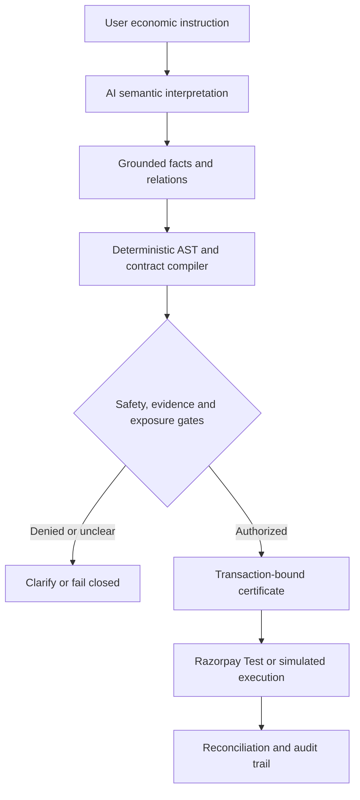
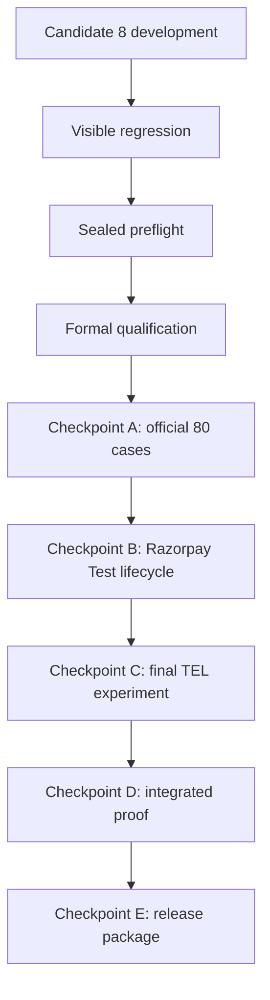

# ECOCOMMIT

**Evidence-calibrated safety controls for AI agents that can create irreversible economic commitments.**

**Razorpay AI Buildathon — Track 1: AI Growth & Agentic Commerce.**

## Project links

- **Demo video:** [Watch ECOCOMMIT on YouTube](https://youtu.be/WjkrzrcffXk)
- **Application:** [Local safety console](http://127.0.0.1:8765/) — available after following Quick Start below
- **Technical submission:** [Architecture, engineering evidence and Buildathon fit](docs/BUILDATHON_SUBMISSION.md)

## Why ECOCOMMIT

ECOCOMMIT sits between an AI agent and an economic action such as buying, paying, booking, hiring, transferring, renewing, reserving, releasing, cancelling, or committing. The language model may interpret semantics, but it does **not** own economic authority. Deterministic code owns validation, Boolean authorization logic, normalization, dependency handling, ambiguity blocking, semantic conservation, transaction eligibility, evidence, and execution permission.

The core principle is simple: **LLM for semantic interpretation; deterministic controls for economic authority.** Unknown or materially ambiguous authorization state fails closed. A missing or invalid receipt never unlocks a downstream checkpoint.

## What a reviewer can verify in five minutes

1. Clone the repository and install the hash-locked dependencies.
2. Run the deterministic test suite.
3. Start the local safety console.
4. Exercise a successful simulation, an upstream-gate denial, and an injected capture failure.
5. Inspect the correlation ID, state transitions, cleanup result, and blocked A–E evidence cards.

The demo is deliberately safe: it performs **no provider call and no money movement**. It proves that the product runs and that missing authority fails closed; it is not presented as an authoritative A/B/C/D/E PASS.

## Architecture



The model may identify meaning. It cannot grant economic authority, choose a policy ceiling, bypass evidence, advance transaction state, or turn an unknown condition into permission. See [Technical Overview](docs/TECHNICAL_OVERVIEW.md) for the component and data-flow description.

The repository is organized around that boundary:

- `src/ecocommit/` — protocol implementation, Semantic IR, validation, compilation, conservation, execution and evidence logic.
- `tests/` — deterministic regression, property/metamorphic, security, workflow and qualification tests.
- `data/` — frozen evaluation inputs and versioned candidate-development partitions.
- `scripts/` — qualification, checkpoint, reproducibility and evidence tooling.
- `ui/` — integrated safety-console demonstration.
- `docs/ARCHITECTURE.md` and `docs/THREAT_MODEL.md` — architecture and trust/safety boundaries.

## Technical stack

| Layer | Technology | Role |
|---|---|---|
| Frontend | HTML5, CSS3, vanilla JavaScript | Responsive safety console, scenario controls, gate state, exposure and audit display |
| Backend/API | Python 3.11+, WSGI | Commit simulation, status, metrics, guarded Test execution and webhook endpoints |
| Validation | Pydantic 2 | Strict typed facts, relations, contracts, receipts and provider payloads |
| AI interpretation | Groq OpenAI-compatible API, `qwen/qwen3.6-27b` | Two-pass grounded fact extraction and relation classification |
| Deterministic safety | Python policy engine, Boolean/dependency AST, conservation checker | Authority decisions, caps, ambiguity handling and fail-closed enforcement |
| Persistence | SQLite with WAL/FULL-sync controls | Commitments, payments, idempotency, webhook evidence and restart recovery |
| Payments | Razorpay REST API, Checkout and HMAC-SHA256 webhooks | Test Mode order, authorization, capture, refund and reconciliation boundary |
| Testing | pytest | Deterministic, security, workflow, property/metamorphic and integration tests |
| CI/evidence | GitHub Actions, SHA-256 manifests and typed receipts | Exact-source validation and retained artifact provenance |
| Deployment | WSGI and hardened nginx templates | Prepared TLS/reverse-proxy single-host deployment boundary |

## Checkpoint truth

The product is runnable now in its deterministic local demonstration. The
remaining evidence chain is intentionally sequential so that no implementation,
workflow colour or screenshot can substitute for an authoritative receipt.



### Remaining execution process

1. Correct the remaining general C8D020 entity/guard boundary and repeat visible development.
2. Run the separate visible regression partition.
3. Freeze the exact Candidate-8 source and consume the sealed preflight once.
4. Run formal Candidate-8 qualification.
5. If qualified, run the official frozen 80-case Checkpoint A evaluation.
6. With an A receipt, execute the provenance-first Razorpay Test Mode lifecycle and produce B evidence.
7. With A+B receipts, run the frozen Total Economic Loss comparison for C.
8. Load legitimate A/B/C receipts through the API/UI and retain the integrated D proof.
9. Produce the exact-source reproduction, evidence index and final E release package.

Current development position: Candidate 8 has reached **23/24 visible cases
(95.83%)**, with 100% selective reliability, 79.17% autonomous coverage and
100% clarification accuracy. One unresolved guard case remains fail-closed and
must be corrected before the next stage.

### Expected post-submission validation timeline

| Work | Expected duration if no new blocker appears |
|---|---:|
| C8D020 correction and deterministic validation | 20–40 minutes |
| Visible-development rerun | 45–60 minutes |
| Regression, sealed preflight and qualification | 1–2 hours |
| Official Checkpoint A with free-tier provider pacing | 2–4 hours |
| Final B/C/D/E execution and evidence | 1–3+ hours |

Before any sealed or official execution, the exact source, prompts, schemas,
provider policy, dataset, evaluator and thresholds are cryptographically bound.

The one-shot internal holdout requires all gates simultaneously:

| Gate | Requirement |
| --- | ---: |
| Case pass rate | ≥ 95% |
| Selective semantic reliability | ≥ 97% |
| Autonomous coverage | ≥ 60% |
| Ambiguous clarification accuracy | ≥ 90% |
| Fail-open errors | 0 |
| Dropped guards | 0 |
| Dropped exceptions | 0 |
| Semantic-conservation failures | 0 |
| UNKNOWN → authorized | 0 |

Only an internal qualification PASS can unlock the official frozen Checkpoint-A run. Official A remains one-shot with case pass ≥ 90%, selective reliability ≥ 95%, autonomous coverage ≥ 55%, and ambiguous clarification accuracy ≥ 80%.

## Quick start

Requires Python 3.11+.

```bash
python -m pip install --require-hashes -r requirements-dev.lock
python -m pip install --no-deps --no-build-isolation -e .
python -m pip check
python -m pytest -p no:cacheprovider
python -m compileall -q src scripts tests
node --check ui/app.js
```

Follow `docs/REPRODUCIBILITY.md` for the clean-machine procedure, source/evidence binding and artifact expectations.

## Local safety-console demo

The `ui/` application demonstrates the economic-control boundary without weakening qualification gates. Use the exact [five-minute demo runbook](docs/DEMO_RUNBOOK.md). Demo output is not treated as benchmark evidence unless a checkpoint protocol explicitly binds it.

## Failure recovery

The failure trail is part of the work, not hidden history. Candidate 7 first hit a Groq output-token-per-minute rejection because the request ceiling exceeded the free-tier OTPM limit. Reducing the bound ceiling to 900 removed the infrastructure failure and exposed the real semantic defect: D003 failed 5/5 while D009 passed 5/5. Candidate 7 was frozen as failed rather than retried until lucky. Candidate 8 then moved into a separate, visible-data-only development protocol. Its three visible iterations improved from 25%, to 75%, to 95.83%. Iteration 3 still failed the safety gate because C8D020 dropped one guard; the rejection remained fail-closed. See [Failure Recovery](docs/FAILURE_RECOVERY.md) for the evidence-linked chronology and engineering lessons.

## Evidence and reports

Key evidence documents are:

- `docs/BUILDATHON_SUBMISSION.md` — Track-1 fit and direct judge rubric mapping.
- `docs/SUBMISSION_EVIDENCE.md` — authoritative evidence index and checkpoint status.
- `docs/REPRODUCIBILITY.md` — exact-source reproduction instructions.
- `docs/ARCHITECTURE.md` — system architecture.
- `docs/TECHNICAL_OVERVIEW.md` — concise implementation and trust-boundary description.
- `docs/FAILURE_RECOVERY.md` — provider, semantic and development-failure chronology.
- `docs/THREAT_MODEL.md` — threat and safety model.
- `docs/DEPLOYMENT_READINESS.md` — deployment/readiness constraints.
- `docs/ENGINEERING_LOG.md` — engineering chronology.

Machine-verifiable receipts and GitHub Actions artifacts remain authoritative over narrative summaries.

## Submission evidence status

The public repository contains the complete implementation, runnable local
product, architecture, security model, test suite, evidence framework and
post-submission execution path. Formal candidate qualification and final A–E
receipts remain sequential validation work. See `SUBMISSION_STATUS.md` for the
current machine-evidence boundary.

## Safety and limitations

ECOCOMMIT is designed to refuse unsupported economic authority rather than guess. Qualification thresholds are not lowered to improve presentation results, and frozen benchmark/evaluator data are not altered after results are observed.

Payment lifecycle demonstrations use **Razorpay TEST MODE only**. Provenance must exist before test transaction creation. Qualification must never use Razorpay Live Mode, real money, or real bank/card/UPI information. Human-only login, OTP, secret-entry or sandbox interactions remain human boundaries rather than automation targets.

## License

Apache-2.0. See `LICENSE` and `docs/LICENSE_DECISION.md`.
