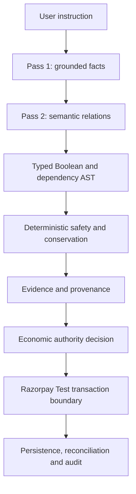

# ECOCOMMIT

**Evidence-calibrated safety infrastructure for AI agents that can create irreversible economic commitments.**

Razorpay AI Buildathon — Track 1: AI Growth & Agentic Commerce.

AI agents can misunderstand conditions, exceptions, payment objects, counterparties, amounts, sequencing, and whether the user actually granted authority. A fluent interpretation is therefore not enough to buy, pay, book, hire, transfer, renew, reserve, release, cancel, or commit.

ECOCOMMIT converts natural-language instructions into typed, inspectable economic contracts and places deterministic controls between probabilistic interpretation and execution. Missing, ambiguous, stale, unsupported, or unverifiable authority fails closed. This makes agentic commerce safer to inspect, test, recover, and audit.

## Project links

- [YouTube demonstration](https://youtu.be/WjkrzrcffXk)
- [Local application](#quick-start)
- [Technical architecture](docs/ARCHITECTURE.md)
- [Evidence index](docs/SUBMISSION_EVIDENCE.md)
- [Reproducibility guide](docs/REPRODUCIBILITY.md)

No public deployment is claimed. The application is available locally after completing Quick Start.

## Problem and objective

Economic instructions combine actions with guards, exceptions, limits, dependencies, and implicit grammatical roles. If an AI silently drops one of those facts—or treats uncertainty as permission—the result may be an irreversible commitment.

ECOCOMMIT extracts source-grounded facts, classifies their relationships, compiles a typed contract, and independently verifies that economically material meaning survives. It refuses execution when authority is missing, ambiguous, inconsistent, stale, or unsupported by the required evidence chain.

## Core design principle

> **LLM for semantic interpretation; deterministic code for economic authority.**

The model may extract grounded facts and classify semantic relations. It cannot grant economic authority, choose policy limits, bypass evidence, fabricate missing conditions, advance transaction state, convert `UNKNOWN` into permission, or authorize payment without valid upstream receipts.

Deterministic code owns schemas, grounding, Boolean and dependency structure, conservation, ambiguity handling, policy limits, evidence validation, transaction eligibility, state transitions, idempotency, reconciliation, and audit.

## Architecture



The implementation has nine layers: natural-language interpretation; typed Semantic IR; Boolean/dependency compilation; conservation and fail-closed validation; evidence and checkpoint receipts; transaction authorization; Razorpay Test lifecycle; SQLite persistence/recovery/audit; and the API/UI safety console.

See [Architecture](docs/ARCHITECTURE.md), [Technical Overview](docs/TECHNICAL_OVERVIEW.md), and [Threat Model](docs/THREAT_MODEL.md).

## End-to-end operation

```text
User instruction → grounded facts → relation classification → typed AST
→ deterministic contract → ambiguity and safety validation → provenance
→ transaction eligibility → Razorpay Test order/capture/refund
→ reconciliation → audit evidence
```

| State | Meaning |
|---|---|
| `COMPILED` | A grounded contract survived deterministic checks; downstream receipts are still required before execution. |
| `CLARIFICATION_REQUIRED` | Material meaning or authority is ambiguous, so the system asks rather than guesses. |
| `REJECTED` | Schema, grounding, conservation, contradiction, or safety validation failed. |
| `PROVIDER_DEFERRED` | The provider could not produce a usable result under the bounded attempt policy; this is not semantic authorization. |

## Technical stack

| Layer | Technology | Purpose |
|---|---|---|
| Frontend | HTML5, CSS3, vanilla JavaScript | Responsive safety console, scenarios, evidence, and audit display |
| Backend/API | Python 3.11+, WSGI | Simulation, status, guarded transaction, and webhook endpoints |
| Validation | Pydantic 2 | Typed facts, relations, contracts, receipts, and provider payloads |
| AI | Groq OpenAI-compatible API with `qwen/qwen3.6-27b` | Two-pass grounded semantic interpretation |
| Deterministic safety | Python policy engine and typed Boolean/dependency AST | Economic authority and fail-closed enforcement |
| Persistence | SQLite with WAL and FULL-sync controls | Commitments, payments, idempotency, webhooks, and restart recovery |
| Payments | Razorpay REST API and HMAC-SHA256 webhooks | Test Mode order, capture, refund, and reconciliation |
| Testing | pytest | Unit, integration, security, property, workflow, and qualification validation |
| Evidence | GitHub Actions, SHA-256 manifests, and typed receipts | Exact-source provenance and checkpoint enforcement |
| Deployment | WSGI and hardened nginx templates | Controlled single-host deployment boundary |

## Safety guarantees

- Fail-closed authorization; missing or invalid authority never becomes permission.
- Strict schema validation and source grounding for every material fact.
- Boolean guard, exception, dependency, and semantic-conservation preservation.
- Closed policy classes and trusted exposure ceilings.
- Provenance-before-order and exact upstream receipt validation.
- Transaction-bound certificates resistant to TOCTOU changes and replay.
- Durable idempotency and legal state-transition enforcement.
- Razorpay Test-only enforcement; Live Mode is prohibited.
- Raw-body webhook HMAC verification, event identity, and reconciliation.
- SQLite restart recovery, compensation, and chained audit history.

## Product demonstration

The local safety console proves application startup, successful deterministic simulation, upstream-gate denial, injected capture failure, cleanup/recovery, correlation IDs, state transitions, evidence cards, and blocked checkpoints without valid receipts.

The demo makes no provider call and moves no real money. It does not substitute for authoritative checkpoint evidence.

## Quick start

Prerequisites: Git and Python 3.11 or newer. Node.js is optional and only needed for the JavaScript syntax check.

### Windows PowerShell

```powershell
git clone https://github.com/sasipriya1221/sasipriya1221-ECOCOMMIT.git
Set-Location sasipriya1221-ECOCOMMIT
python -m venv .venv
.venv\Scripts\python.exe -m pip install --require-hashes -r requirements-dev.lock
.venv\Scripts\python.exe -m pip install --no-deps --no-build-isolation -e .
.venv\Scripts\python.exe -m pip check
.venv\Scripts\python.exe -m pytest -p no:cacheprovider --basetemp .test-tmp-reproduction
.venv\Scripts\python.exe scripts\checkpoint_d_server.py --port 8765
```

### Unix/macOS

```bash
git clone https://github.com/sasipriya1221/sasipriya1221-ECOCOMMIT.git
cd sasipriya1221-ECOCOMMIT
python3 -m venv .venv
.venv/bin/python -m pip install --require-hashes -r requirements-dev.lock
.venv/bin/python -m pip install --no-deps --no-build-isolation -e .
.venv/bin/python -m pip check
.venv/bin/python -m pytest -p no:cacheprovider --basetemp .test-tmp-reproduction
.venv/bin/python scripts/checkpoint_d_server.py --port 8765
```

Open <http://127.0.0.1:8765/> and run `HAPPY_PATH`, `CHECKPOINT_A_BLOCKED`, and `CAPTURE_FAILURE`. See the [five-minute demo runbook](docs/DEMO_RUNBOOK.md).

## Repository structure

- `src/ecocommit/` — contracts, semantic candidates, safety policy, transactions, evidence, persistence, and audit
- `tests/` — deterministic, integration, security, property, workflow, and receipt validation
- `data/` — versioned evaluation and visible-development corpora
- `scripts/` — qualification, checkpoint, reproduction, and evidence tooling
- `ui/` — local safety console
- `docs/` — architecture, threat model, evidence, deployment, and runbooks
- `evidence/` — retained machine-readable evidence and request bindings
- `.github/workflows/` — exact-source CI and gated provider/Test Mode execution

## Evaluation and evidence

Candidate-8 is frozen at source `850a7b5f1f21d7951cd4a9a840c0bebbb635d594`. It passed visible development, visible regression, sealed preflight, and formal qualification, then legitimately **FAILED** official Checkpoint A. Its terminal evidence is preserved; it was not retried until lucky.

Checkpoints B–E remain **BLOCKED** because there is no valid A PASS receipt. Candidate-9 is newly authorized under a separate visible-evidence-only development protocol. No receipt is valid unless its exact-source, dataset, evaluator, configuration, upstream evidence, run, attempt, and artifact bindings validate.

See [Submission Evidence](docs/SUBMISSION_EVIDENCE.md), [Progress](PROGRESS.md), and [Submission Status](SUBMISSION_STATUS.md).

## Failure recovery

Groq’s initial HTTP 429 was diagnosed as an output-tokens-per-minute conflict: the bound request ceiling exceeded the 1,000-token limit. A preregistered 900-token ceiling removed that infrastructure failure. Candidate-7 then exposed a genuine semantic defect and was frozen.

Candidate-8 introduced typed semantic roles, stronger AST/conservation handling, and source-order action resolution. Visible defects were corrected only from permitted visible evidence. Candidate-8 passed its internal gates but failed official A; that failure was preserved rather than mined for patches or retried. Candidate-9 is isolated as a new candidate with official and hidden evidence explicitly forbidden during development. See [Failure Recovery](docs/FAILURE_RECOVERY.md).

## Limitations

- Razorpay Live Mode and real money are prohibited.
- The authoritative chain stops at Candidate-8’s failed Checkpoint A result.
- B–E have implemented/local validation paths but no authoritative PASS receipts.
- Semantic evaluation depends on an external model provider.
- Qualification results do not guarantee unrestricted production safety.
- Bundled deployment configuration is not evidence of a public or highly available service.

## License

Licensed under [Apache-2.0](LICENSE). See the [license decision](docs/LICENSE_DECISION.md).
